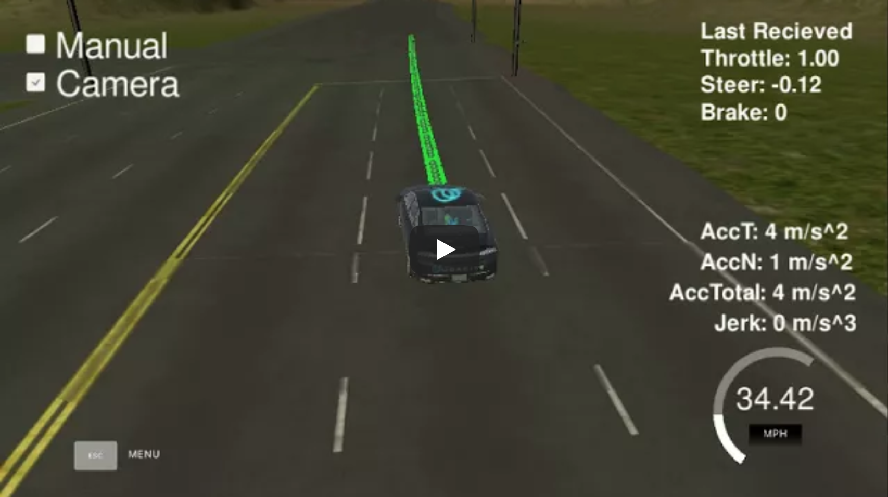
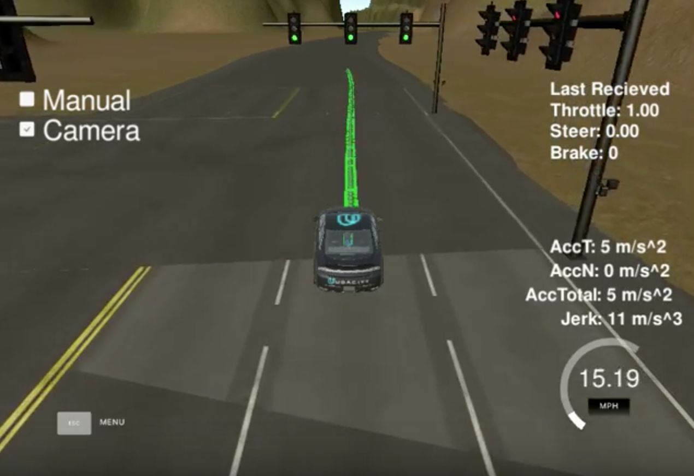

## Capstone Project - Bos Robo Car Team
This is the Capstone project for the Udacity Self-Driving Car Nanodegree. We developed software to guide a real self-driving car around a test track. Using the Robot Operating System (ROS), we created nodes for traffic light detection and classification, trajectory planning, and control.

### Team: **Bos Robo Car**

* **Olga Oleksyuk** [github](https://github.com/ooleksyuk), [emai](mail@olga-v.com) - team lead 
* **Isharaka Gunasinghe** [github](https://github.com/isharaka), [email](isharaka@yahoo.com)
* **Shay Fadida** [github](https://github.com/fadida), [email](shayfad@post.bgu.ac.il)
* **Ioannis Tornazakis** [github](https://github.com/itornaza), [email](itornaza(at)gmail.com)
* **Jaeil Park** [github](https://github.com/jae1e), [email](parkjaeil0108(at)gmail.com)

### Rubric Points:

* Smoothly follows waypoints in the simulator.
* Respects the target top speed set for the waypoints' twist.twist.linear.x in waypoint_loader.py. Works by testing with different values for kph velocity parameter in /ros/src/waypoint_loader/launch/waypoint_loader.launch. Vehicle adheres to the kph target top speed set here.
* Stops at traffic lights when needed.
* Stops and restarts PID controllers depending on the state of /vehicle/dbw_enabled.
* Publishes throttle, steering, and brake commands at 50hz.
* Launches correctly using the launch files provided in the capstone repo. 

[](https://youtu.be/ol_FAZobGF0)
_(click on the image to play video) Credits: **Jaeil Park**_

### What we have implemented? 

* **Traffic Light Detector and Classifier** 
* **Trajectory Planner**
* **Waypoint Follower**
* **Stability Controller**
* **Gain Controller**

### Project Components

#### Traffic Light Detector and Classifier

Car receives image from the camera, system can detect and classify a traffic light color, if the traffic light is not detected no traffic light None is returned. 
First part is to detect a traffic light and a second part is to classify a color of the detected light. If the traffic light is not detected the program returns None for traffic light.

##### Traffic light Detection
The project is aimed at detecting traffic light on the incoming picture either from Simulator or from Carla. I’ve used [UNet Architecture](https://lmb.informatik.uni-freiburg.de/people/ronneber/u-net/).
For the traffic light detection I've used a previously trained model and weights from [Kaggle Ultrasound Nerve Segmentation](https://github.com/ooleksyuk/kaggle-ultrasound-nerve-segmentation).
Network has been trained on augmented images that are created via `image_prosessor.py` script. Loss function is based on `dice coefficient`.
See training code in [detector](https://github.com/ooleksyuk/CarND-Traffic-Light-Detector-Classifier/tree/master/tl_detector) and inference code in [tl_detector.py](https://github.com/ooleksyuk/CarND-Capstone/blob/master/ros/src/tl_detector/tl_detector.py).
The weights are located in `weights.h5`. Data for training was provided by Udacity from ros bag (traffic_light_bag_files). It's ignored because files can be downloaded from Udacity website and unpack using RosBag instructions.
I've used a pre-trained model that looks like this:
```bash
____________________________________________________________________________________________________
Layer (type)                     Output Shape          Param #     Connected to
====================================================================================================
input_1 (InputLayer)             (None, 96, 128, 1)    0
____________________________________________________________________________________________________
conv2d_1 (Conv2D)                (None, 96, 128, 32)   320         input_1[0][0]
____________________________________________________________________________________________________
conv_1_2 (Conv2D)                (None, 96, 128, 32)   9248        conv2d_1[0][0]
____________________________________________________________________________________________________
maxpool_1 (MaxPooling2D)         (None, 48, 64, 32)    0           conv_1_2[0][0]
____________________________________________________________________________________________________
conv_2_1 (Conv2D)                (None, 48, 64, 64)    18496       maxpool_1[0][0]
____________________________________________________________________________________________________
conv_2_2 (Conv2D)                (None, 48, 64, 64)    36928       conv_2_1[0][0]
____________________________________________________________________________________________________
maxpool_2 (MaxPooling2D)         (None, 24, 32, 64)    0           conv_2_2[0][0]
____________________________________________________________________________________________________
conv_3_1 (Conv2D)                (None, 24, 32, 128)   73856       maxpool_2[0][0]
____________________________________________________________________________________________________
conv_3_2 (Conv2D)                (None, 24, 32, 128)   147584      conv_3_1[0][0]
____________________________________________________________________________________________________
maxpool_3 (MaxPooling2D)         (None, 12, 16, 128)   0           conv_3_2[0][0]
____________________________________________________________________________________________________
conv_4_1 (Conv2D)                (None, 12, 16, 256)   295168      maxpool_3[0][0]
____________________________________________________________________________________________________
conv_4_2 (Conv2D)                (None, 12, 16, 256)   590080      conv_4_1[0][0]
____________________________________________________________________________________________________
maxpool_4 (MaxPooling2D)         (None, 6, 8, 256)     0           conv_4_2[0][0]
____________________________________________________________________________________________________
conv_5_1 (Conv2D)                (None, 6, 8, 512)     1180160     maxpool_4[0][0]
____________________________________________________________________________________________________
conv_5_2 (Conv2D)                (None, 6, 8, 512)     2359808     conv_5_1[0][0]
____________________________________________________________________________________________________
convtran_6 (Conv2DTranspose)     (None, 12, 16, 256)   524544      conv_5_2[0][0]
____________________________________________________________________________________________________
up_6 (Concatenate)               (None, 12, 16, 512)   0           convtran_6[0][0]
                                                                   conv_4_2[0][0]
____________________________________________________________________________________________________
conv_6_1 (Conv2D)                (None, 12, 16, 256)   1179904     up_6[0][0]
____________________________________________________________________________________________________
conv_6_2 (Conv2D)                (None, 12, 16, 256)   590080      conv_6_1[0][0]
____________________________________________________________________________________________________
convtran_7 (Conv2DTranspose)     (None, 24, 32, 128)   131200      conv_6_2[0][0]
____________________________________________________________________________________________________
up_7 (Concatenate)               (None, 24, 32, 256)   0           convtran_7[0][0]
                                                                   conv_3_2[0][0]
____________________________________________________________________________________________________
conv_7_1 (Conv2D)                (None, 24, 32, 128)   295040      up_7[0][0]
____________________________________________________________________________________________________
conv_7_2 (Conv2D)                (None, 24, 32, 128)   147584      conv_7_1[0][0]
____________________________________________________________________________________________________
convtran_8 (Conv2DTranspose)     (None, 48, 64, 64)    32832       conv_7_2[0][0]
____________________________________________________________________________________________________
up_8 (Concatenate)               (None, 48, 64, 128)   0           convtran_8[0][0]
                                                                   conv_2_2[0][0]
____________________________________________________________________________________________________
conv_8_1 (Conv2D)                (None, 48, 64, 64)    73792       up_8[0][0]
____________________________________________________________________________________________________
conv_8_2 (Conv2D)                (None, 48, 64, 64)    36928       conv_8_1[0][0]
____________________________________________________________________________________________________
convtran_9 (Conv2DTranspose)     (None, 96, 128, 32)   8224        conv_8_2[0][0]
____________________________________________________________________________________________________
up_9 (Concatenate)               (None, 96, 128, 64)   0           convtran_9[0][0]
                                                                   conv_1_2[0][0]
____________________________________________________________________________________________________
conv_9_1 (Conv2D)                (None, 96, 128, 32)   18464       up_9[0][0]
____________________________________________________________________________________________________
conv_9_2 (Conv2D)                (None, 96, 128, 32)   9248        conv_9_1[0][0]
____________________________________________________________________________________________________
conv2d_2 (Conv2D)                (None, 96, 128, 1)    33          conv_9_2[0][0]
====================================================================================================
Total params: 7,759,521
Trainable params: 7,759,521
Non-trainable params: 0
```
Model has been trained using
```python
IMAGE_ROWS = 96
IMAGE_COLS = 128
COLORS = 3
SMOOTH = 1.
ACTIVATION = 'relu'
PADDING = 'same'
KERNEL_SIZE = (3, 3)
STRIDES = (2, 2)
```

##### Dummy Traffic Light Detector

In order to expedite the development of the project, a dummy detector class was implemented right from the start. It can be found for your reference at `./ros/src/tl_detector/dummy_detector.py`. This way, all of the project nodes could be implemented without the need of the live traffic light classifier, thus, allowing more time for its implementation. This detector is based on getting the traffic light state from the `/vehicle/traffic_lights` ros topic which is provided by the simulator as an extra tool for development. However, this facility CANNOT be used on Carla, Udacity’s real self-driving car.

##### Traffic light Classifier

The project is aimed at classifying traffic light on the incoming picture either from Simulator or from Carla. Code for classifier is located [here](https://github.com/ooleksyuk/CarND-Traffic-Light-Detector-Classifier/tree/master/tl_classifier).
Four output classes: Red, Yellow, Green, None.
Test accuracy was 99.8% for Simulator images and 85.4% for Carla images.
See inference code in [tl_classifier.py](https://github.com/ooleksyuk/CarND-Capstone/blob/master/ros/src/tl_detector/light_classification/tl_classifier.py).
I've used two different models for Simulator and for Carla.
Simulator model summary:
```bash
_________________________________________________________________
Layer (type)                 Output Shape              Param #   
=================================================================
conv2d_3 (Conv2D)            (None, 64, 32, 32)        896       
_________________________________________________________________
max_pooling2d_3 (MaxPooling2 (None, 32, 16, 32)        0         
_________________________________________________________________
conv2d_4 (Conv2D)            (None, 32, 16, 32)        9248      
_________________________________________________________________
max_pooling2d_4 (MaxPooling2 (None, 16, 8, 32)         0         
_________________________________________________________________
flatten_2 (Flatten)          (None, 4096)              0         
_________________________________________________________________
dense_3 (Dense)              (None, 8)                 32776     
_________________________________________________________________
dense_4 (Dense)              (None, 4)                 36        
=================================================================
Total params: 42,956
Trainable params: 42,956
Non-trainable params: 0
_________________________________________________________________
```

Carla model summary:
```bash
_________________________________________________________________
Layer (type)                 Output Shape              Param #   
=================================================================
conv2d_2 (Conv2D)            (None, 64, 32, 32)        896       
_________________________________________________________________
max_pooling2d_2 (MaxPooling2 (None, 32, 16, 32)        0         
_________________________________________________________________
flatten_2 (Flatten)          (None, 16384)             0         
_________________________________________________________________
dense_3 (Dense)              (None, 8)                 131080    
_________________________________________________________________
dense_4 (Dense)              (None, 4)                 36        
=================================================================
Total params: 132,012
Trainable params: 132,012
Non-trainable params: 0
_________________________________________________________________
```
I have trained both models with the following parameters:
```python
epochs=30, 
validation_split=0.1, 
shuffle=True
```
For Simulator I had more data samples and used batch_size=128 as for Carla was I had to increase batch_size=256 to predictions.

###### This is the project repo for the final project of the Udacity Self-Driving Car Nanodegree: Programming a Real Self-Driving Car. For more information about the project, see the project introduction [here](https://classroom.udacity.com/nanodegrees/nd013/parts/6047fe34-d93c-4f50-8336-b70ef10cb4b2/modules/e1a23b06-329a-4684-a717-ad476f0d8dff/lessons/462c933d-9f24-42d3-8bdc-a08a5fc866e4/concepts/5ab4b122-83e6-436d-850f-9f4d26627fd9).

Please use **one** of the two installation options, either native **or** docker installation.

### Native Installation

* Be sure that your workstation is running Ubuntu 16.04 Xenial Xerus or Ubuntu 14.04 Trusty Tahir. [Ubuntu downloads can be found here](https://www.ubuntu.com/download/desktop).
* If using a Virtual Machine to install Ubuntu, use the following configuration as minimum:
  * 2 CPU
  * 2 GB system memory
  * 25 GB of free hard drive space

  The Udacity provided virtual machine has ROS and Dataspeed DBW already installed, so you can skip the next two steps if you are using this.

* Follow these instructions to install ROS
  * [ROS Kinetic](http://wiki.ros.org/kinetic/Installation/Ubuntu) if you have Ubuntu 16.04.
  * [ROS Indigo](http://wiki.ros.org/indigo/Installation/Ubuntu) if you have Ubuntu 14.04.
* [Dataspeed DBW](https://bitbucket.org/DataspeedInc/dbw_mkz_ros)
  * Use this option to install the SDK on a workstation that already has ROS installed: [One Line SDK Install (binary)](https://bitbucket.org/DataspeedInc/dbw_mkz_ros/src/81e63fcc335d7b64139d7482017d6a97b405e250/ROS_SETUP.md?fileviewer=file-view-default)
* Download the [Udacity Simulator](https://github.com/udacity/CarND-Capstone/releases).

### Docker Installation
[Install Docker](https://docs.docker.com/engine/installation/)

Build the docker container
```bash
docker build . -t capstone
```

Run the docker file
```bash
docker run -p 4567:4567 -v $PWD:/capstone -v /tmp/log:/root/.ros/ --rm -it capstone
```

### Port Forwarding
To set up port forwarding, please refer to the [instructions from term 2](https://classroom.udacity.com/nanodegrees/nd013/parts/40f38239-66b6-46ec-ae68-03afd8a601c8/modules/0949fca6-b379-42af-a919-ee50aa304e6a/lessons/f758c44c-5e40-4e01-93b5-1a82aa4e044f/concepts/16cf4a78-4fc7-49e1-8621-3450ca938b77)

### Usage

1. Clone the project repository
```bash
git clone https://github.com/udacity/CarND-Capstone.git
```

2. Install python dependencies
```bash
cd CarND-Capstone
pip install -r requirements.txt
```
3. Make and run styx
```bash
cd ros
catkin_make
source devel/setup.sh
roslaunch launch/styx.launch
```
4. Run the simulator

### Real world testing
1. Download [training bag](https://s3-us-west-1.amazonaws.com/udacity-selfdrivingcar/traffic_light_bag_file.zip) that was recorded on the Udacity self-driving car.
2. Unzip the file
```bash
unzip traffic_light_bag_file.zip
```
3. Play the bag file
```bash
rosbag play -l traffic_light_bag_file/traffic_light_training.bag
```
4. Launch your project in site mode
```bash
cd CarND-Capstone/ros
roslaunch launch/site.launch
```
5. Confirm that traffic light detection works on real life images
